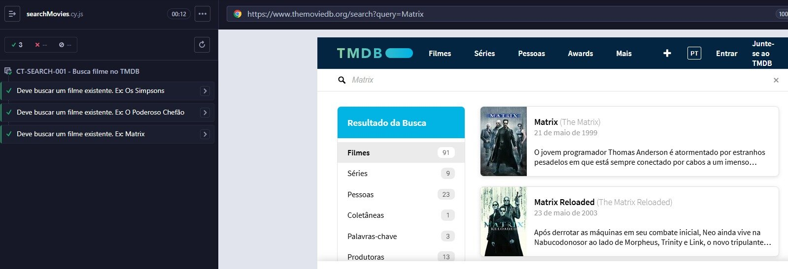

# 🐞 Squad 06 – BugBusters



## 🎬 Demonstração em Ação


Projeto desenvolvido com foco em **Qualidade de Software (QA)**, utilizando **testes automatizados de interface web (UI)** para validar funcionalidades da plataforma **The Movie Database (TMDB)**.

---

## 📌 Objetivo

Este projeto tem como objetivo aplicar conceitos de:

* ✅ Automação de testes de interface (UI)
* ✅ Page Object Model (POM)
* ✅ Comandos customizados Cypress
* ✅ Testes de validação positivos e negativos

A funcionalidade atualmente validada é:

🔎 **Busca de filmes na interface web do TMDB**

---

## 🛠️ Tecnologias Utilizadas

* **Node.js** - Ambiente de execução JavaScript
* **JavaScript** - Linguagem de programação
* **Cypress** - Framework de testes E2E
* **npm** - Gerenciador de pacotes

---

## 📂 Estrutura do Projeto

```
Squad_06_BugBusters/
├── cypress/
│   ├── e2e/
│   │   └── searchMovies/
│   │       ├── searchMovies.cy.js    # CT-SEARCH-001
│   │       ├── searchMovies2.cy.js   # CT-SEARCH-002
│   │       └── searchMovies3.cy.js   # CT-SEARCH-003
│   ├── fixtures/
│   ├── images/
│   ├── pages/
│   │   └── searchMovies-page.js      # Page Object com comandos
│   └── support/
│       ├── commands.js
│       └── e2e.js
├── cypress.config.js
├── package-lock.json
├── package.json
└── readme.md
```

---

## 🚀 Como Executar o Projeto

### 🔧 1. Pré-requisitos

Certifique-se de ter instalado:

* **Git**
* **Node.js** (versão 14 ou superior)
* **npm**

Verifique no terminal:

```bash
node -v
npm -v
git --version
```

---

### 📥 2. Clonar o Repositório

```bash
git clone https://github.com/weberfern/Bootcamp-Avanti-Atlantico-Quality-Assurance.git
cd "Squad_06_BugBusters"
```

---

### 📦 3. Instalar as Dependências

```bash
npm install
```

---

### ▶️ 4. Executar os Testes

**Modo interativo (Cypress UI):**

```bash
npx cypress open
```

**Modo headless (linha de comando):**

```bash
npx cypress run
```

**Executar teste específico:**

```bash
npx cypress run --spec "cypress/e2e/searchMovies/searchMovies.cy.js"
```

---

## 🧪 Cenários de Teste Implementados

### ✅ CT-SEARCH-001 – Buscar filmes existentes

**Arquivo:** `searchMovies.cy.js`

**Objetivo:** Validar busca de filmes válidos e existentes na base do TMDB

**Casos de teste:**
* Busca por "Os Simpsons"
* Busca por "O Poderoso Chefão"
* Busca por "Matrix"

**Validação:** Verifica se o nome do filme aparece nos resultados da busca

---

### ❌ CT-SEARCH-002 – Buscar filmes inexistentes

**Arquivo:** `searchMovies2.cy.js`

**Objetivo:** Validar comportamento ao buscar termos que não são filmes válidos

**Casos de teste:**
* Busca por "filme inexistente"
* Busca por "qa automatizado berimbal metalizado"
* Busca por "qa automatizado é legal"

**Validação:** Verifica exibição da mensagem "Não foram encontrados filmes que correspondam aos seus critérios de busca."

---

### 🔍 CT-SEARCH-003 – Busca sem entrada de texto

**Arquivo:** `searchMovies3.cy.js`

**Objetivo:** Validar comportamento ao submeter busca sem digitar nada

**Casos de teste:**
* Submissão de busca vazia (apenas pressionar Enter)

**Validação:** Verifica exibição da mensagem "Não foram encontrados filmes que correspondam aos seus critérios de busca."

---

## 🎯 Comandos Customizados

Os comandos customizados estão definidos em `cypress/pages/searchMovies-page.js`:

### `cy.searchMovie(movieName)`
Busca um filme existente e valida se aparece nos resultados.

### `cy.searchMovieInexistent(movieName)`
Busca um filme inexistente e valida mensagem de erro.

### `cy.searchMovieEmpty()`
Submete busca vazia e valida mensagem de erro.

---

## ⚙️ Configurações do Cypress

O arquivo `cypress.config.js` possui as seguintes configurações:

* **Gravação de vídeo:** Habilitada
* **Compressão de vídeo:** 32
* **Modo E2E:** Configurado

---

## 📝 Licença

ISC

---

## 🔗 Repositório

[GitHub - Quality Assurance Bootcamp Atlântico Avanti](https://github.com/weberfern/Quality-Assurance---Bootcamp-Atlantico-Avanti.git)

## 📊 Ambiente de Teste

* Navegador: Chrome
* Sistema Operacional: Windows
* Ferramenta de Automação: Cypress

---

## 👥 Equipe

**Squad 06 – BugBusters**
- Antonio Elivelton Moura da Silva
- Fernanda Francisconi Schmidt
- Luan de Souza Martins
- Mariene Silva da Cruz Santos
- Nycole Maria Costa Rodrigues
- Rafaela Cristina de Souza Nascimento
- Samayra Damasceno Sales
- Weber Fernandes da Silva
- Yuri Lima Rebouças de Oliveira

---

## 📌 Status do Projeto

🚧 Em evolução – novos cenários de teste serão adicionados.

---